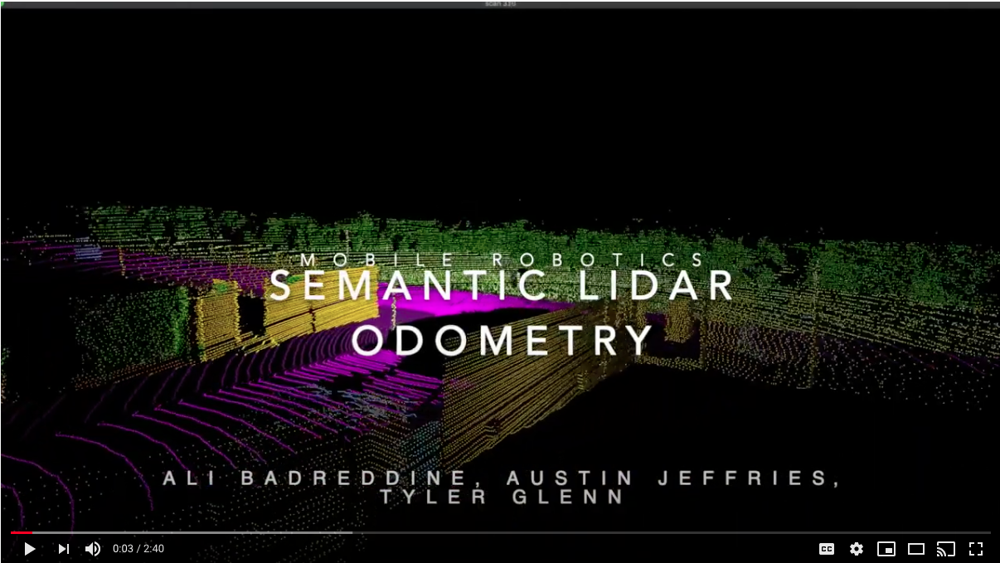

# SLO
Semantic Lidar Odometry

This is the Mobile Robotics Project for the Ford 3 Group: 

__Group Members:__ Ali Badreddine, Austin Jeffries, and Tyler Glenn

## SLO


Using the semantic-icp algorithm in conjunction with the widely available GTSAM library we were able to compute the relative transformation between two semantically labelled point clouds that are near and used these calculated transformations to do odometry using the iSAM2 solver in GTSAM. The code implememtation is contained on this page. Please read our paper which is linked [here](EECS_568_Final_Project.pdf).


[](https://www.youtube.com/watch?v=0wvZ5xyvVrM)

## Required Libraries
* GTSAM
* semantic-icp


Our master branch is organized into three main folders. 


## SLAM_ON_LIDAR

This folder contains code for the following:
1. The main MATLAB run file to run through the 00 trajectory ```run_00.m ```
2. The main MATLAB run file to run through the 07 trajectory ``` run_07.m ```

Please reference the read me inside this folder to get this code working. 
[README.md](https://github.com/tglenn28/SLO/tree/master/SLAM_ON_LIDAR)

## semantic-icp

This folder contains our slightly modified version of the great work done by Steven Parkison. Please reference the read me inside this folder to get this code working. 
[README.md](https://github.com/tglenn28/SLO/tree/master/Semantic-icp)

## utils

This folder contains utility code for our implementation of Semantic Lidar Odometry


## Acknowledgements

We would like to thank our professor, Maani Ghaffari Jadidi for his overall guidance on this project and Steven Parkison for his support in using his semantic-icp library correctly.


